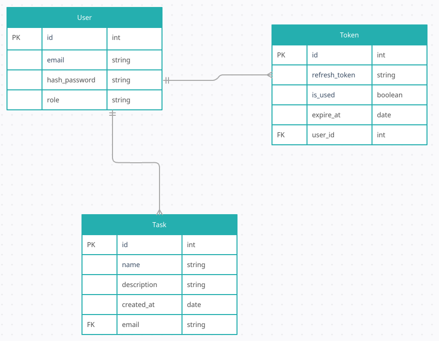

# JWT With fastAPI assignment 

## Project Setups :- 

#### clone repository : 

    git clone https://github.com/suchit-hirani-python-ak/Jwt_Assignment.git

    cd Jwt_Assignment

## Project docker commands : 

    docker compose up --build

    docker compose logs -f 

### Folder structure 

#### app/api 

- This contains four files for different routers.

    2. auth route : This contain register endpoint , login endpoint and refresh endpoint for refresh token.

    3. user route : In this admin can see all users but restricted for role "user" and me endpoint he/she can see his/her profile.

    4. task route : This route contain all crud operation for user and 5 endpoints create task, view ask, edit task, delete task and also if it will be role admin can see all tasks .

#### app/core

- This contains 3 files. 

    1. congifg.py : This file contain all information related to env file.

    2. dependencies.py : This file hase rolechecker and get_current_user.

    3. security.py : This file contain redis server, oauth2scheme bearer, generate access and refresh token.

#### app/db 

- This conatains 2 db related files.

    1. base.py : Conatins base class for database schemas so there is no error of circular import.

    2. session.py : Contains async session factory and setup of database.

#### app/exception 

- This contains custom exception classes.

    1. exceptions.py : Contains custom exception classes.

#### app/models

- This contains Database models for tables.

- Entity Relation diagram for this is shown below. 

    - Users table contains all information of users. Here we also stores version of refresh token so we can keep track of expired refresh token or stolen token.

    - tasks table contains all tasks of users.

    - lock_account table contains how many time user has attempted wrongly with timestamps, so we can log account after some tries"

#### api/repository 

- This contains all interations with database and all queries written here.

#### api/schemas

- It has pydentic schemas for request and response model.

#### api/service

- It conatain business logic and exception handling.

### Some important logics of functionalities.

- Refresh token : 

    *  Validation: Upon receiving a refresh token, the system verifies its authenticity and confirms the token_type is explicitly set to refresh.

    *   Concurrency & Security: The system performs a version check in database. If the stored token_version is greater than the version in the user's token, the request is rejected (this prevents the use of compromised or old tokens).

    *   Rotation: If the version matches, the system invalidates the current session by incrementing the version in the database and issuing a brand-new pair of Access and Refresh tokens.

- Redis-Backed Account Lockout :

    *   Real-time Tracking: Failed login attempts are tracked in Redis using a combination of the user's identifier and a failure counter(Maximum 5 attempts).

    *   Threshold Enforcement: During login, the system checks the Redis counter. If the max_attempts threshold is reached, a TTL (Time-To-Live) on the Redis key enforces the lockout period.

    *   Auto-Reset: Once the lockout duration expires, Redis automatically clears the key. A successful login also triggers an explicit reset of the failure counter(10 minutes cooldown).

- Rate limiting : 

    *   Implementation: Rate limiting is enforced via the fastapi_limiter module.

    *   Threshold: To prevent brute-force attacks and resource exhaustion, users are restricted to a maximum of 5 requests every 10 seconds (enforced globally in main.py).

- Docker compose :
    *   Architecture: The entire stack is Docker Compose, ensuring a consistent environment for the FastAPI and Redis.

    *   Security: Sensitive credentials are managed via a .env file that is injected into the containers at runtime but excluded from the image build (via .dockerignore) to prevent credential leakage.

    *   Reliability: The application service uses depends_on health checks to ensure the Redis and Database services are fully operational before the API starts accepting traffic(on single change it add data in db at 60sec so, data can be persistant).

[click here] https://docs.google.com/document/d/1OqS12l1nAEcn3o4CrKn7BXGdaHmlAQOhYyI_-qb--UI/edit?tab=t.0